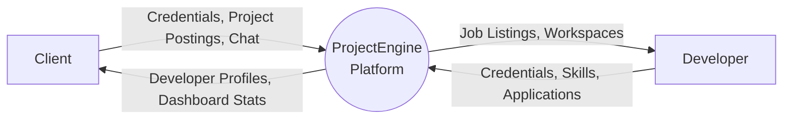
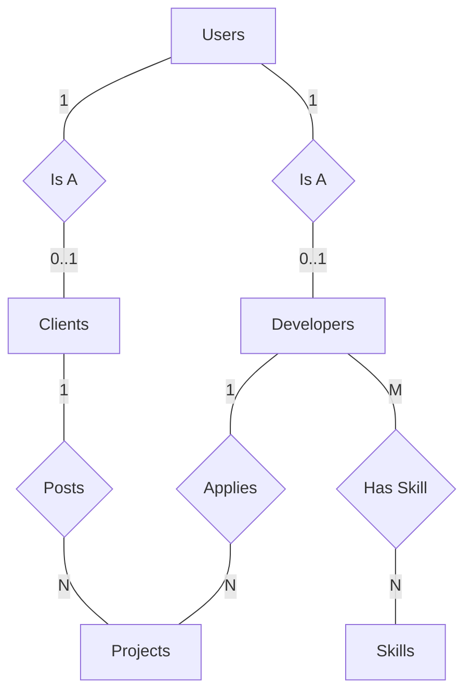
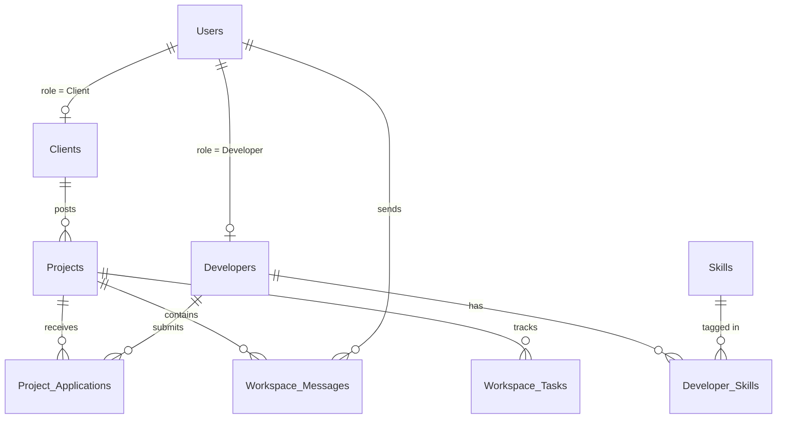

# ProjectEngine Technical Documentation

  

Welcome to the comprehensive technical documentation for **ProjectEngine**, a full-stack hiring and project collaboration platform. This document covers architecture, database design, API reference, and system diagrams.

---

## 📑 Table of Contents
1. [Executive Summary](#1-executive-summary)
2. [Architecture & System Design](#2-architecture--system-design)
3. [Data Dictionary & Database Schema](#3-data-dictionary--database-schema)
4. [System Diagrams](#4-system-diagrams)
5. [Security Considerations](#5-security-considerations)
6. [Setup & Installation](#6-setup--installation)

---

## 1. Executive Summary
ProjectEngine is designed to facilitate the connection between clients who need software projects built and developers who possess the technical skills to build them. The platform serves as a dedicated technical hiring ecosystem, providing role-based authentication, developer discovery with skill-level filtering, complete project lifecycle management, an interactive Kanban-style workspace, and real-time messaging.

**Key Highlights:**
- **Dual Hiring Pathways:** Clients can hire developers directly, or developers can apply to open projects.
- **Three-Tier Architecture:** Vanilla HTML/CSS/JS frontend, PHP REST API backend, Microsoft SQL Server database.
- **Framework-less:** Built entirely without heavy frontend frameworks or ORMs for maximum portability and fundamental skill demonstration.

---

## 2. Architecture & System Design

### 2.1 Three-Tier Architecture
The platform cleanly separates presentation, business logic, and data persistence.

| Tier | Components | State Management | Communication |
|---|---|---|---|
| **Presentation** | HTML pages, `style.css`, `script.js` | `localStorage` (isLoggedIn, userRole) | `fetch()` API / JSON |
| **Application** | 20 PHP REST endpoints | `$_SESSION` superglobal | Parameterized SQL |
| **Data** | SQL Server (ProjectEngineDB) | ACID compliance | CHECK constraints |

### 2.2 Data Flow Patterns (Fetch API)
All frontend-to-backend communication follows a consistent pattern using the Fetch API. Read operations use `GET`, while write operations use `POST` with `FormData`. Error handling follows HTTP status code conventions (401 Auth, 404 Missing, 409 Conflict).

---

## 3. Data Dictionary & Database Schema

The database consists of nine tables organized around a central `Users` supertype with `Clients` and `Developers` as role-specific subtypes, following the ISA (Inheritance) pattern.

### 3.1 Users (ISA Supertype)
Stores central identity records for all registered users.

| Column | Type | Constraints | Description |
|---|---|---|---|
| `user_id` | INT IDENTITY | **PK** | Auto-generated unique identifier |
| `email` | VARCHAR(255) | **UK**, NOT NULL | User email address (login) |
| `password_hash` | VARCHAR(255) | NOT NULL | bcrypt-hashed password |
| `role` | VARCHAR(20) | CHECK (Client, Developer) | Access permissions role |

### 3.2 Developers (ISA Subtype)
| Column | Type | Constraints | Description |
|---|---|---|---|
| `dev_id` | INT | **PK, FK** (Users) | Shared primary key (ISA pattern) |
| `level` | VARCHAR(20) | CHECK (Trainee, Junior, Mid, Senior) | Experience tier |
| `is_booked` | BIT | DEFAULT 0 | Availability flag (0=Available) |

### 3.3 Projects
The central entity for core business logic and project lifecycle.

| Column | Type | Constraints | Description |
|---|---|---|---|
| `project_id` | INT IDENTITY | **PK** | Auto-generated project ID |
| `client_id` | INT | **FK** (Clients) ON DELETE CASCADE | Owning client reference |
| `status` | VARCHAR(20) | CHECK (Pending, Active, Completed) | Project lifecycle status |

*(For full tables including Skills, Workspace_Messages, and Tasks, refer to the Database Reference Document).*

---

## 4. System Diagrams

This section visually maps the technical text above into academic models.

### 4.1 Context Diagram (DFD Level 0)
Treats the entire platform as a single process interacting with external entities.

### 4.2 ERD (Chen's Notation)
Visualizes entities and relationships using academic notation (Diamonds = Relationships).

### 4.3 ERD (Schema Crow's Foot)
Maps the exact physical SQL database structure.

---

## 5. Security Considerations

### 5.1 Implemented Measures
1. **Password Hashing:** `PASSWORD_BCRYPT` with automatic salt generation.
2. **SQL Injection Prevention:** 100% usage of parameterized statements via `sqlsrv`.
3. **Data Integrity:** `CHECK` constraints on all enum strings (`status`, `role`, `level`) preventing bad data at the database level.

### 5.2 Identified Gaps (Future Roadmap)
| Issue | Severity | Recommended Mitigation |
|---|---|---|
| **No CSRF Protection** | High | Implement anti-CSRF tokens in all POST forms |
| **XSS via innerHTML** | High | Replace `innerHTML` with `textContent` or sanitize output |
| **No Rate Limiting** | High | Add exponential backoff to the login endpoint |

---

## 6. Setup & Installation

1. Install **XAMPP** (PHP 8.x) and **SQL Server 2019 Express**.
2. Install the **PHP sqlsrv extension** (ODBC Driver 17).
3. Execute `database/schema.sql` in SQL Server Management Studio.
4. Update `api/db_connect.php` with your `.\SQLEXPRESS01` credentials.
5. Launch via `http://localhost/ProjectEngine/index.html`.
