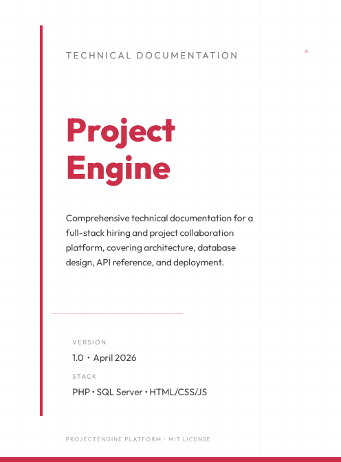
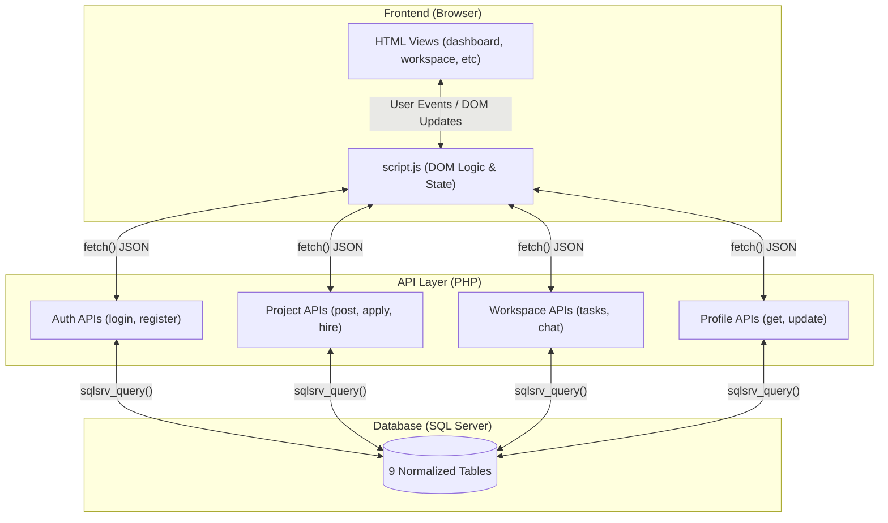
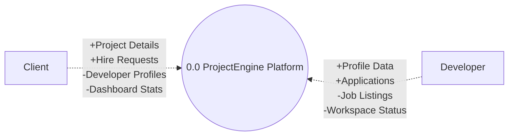
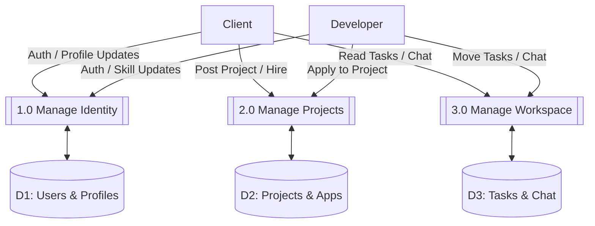
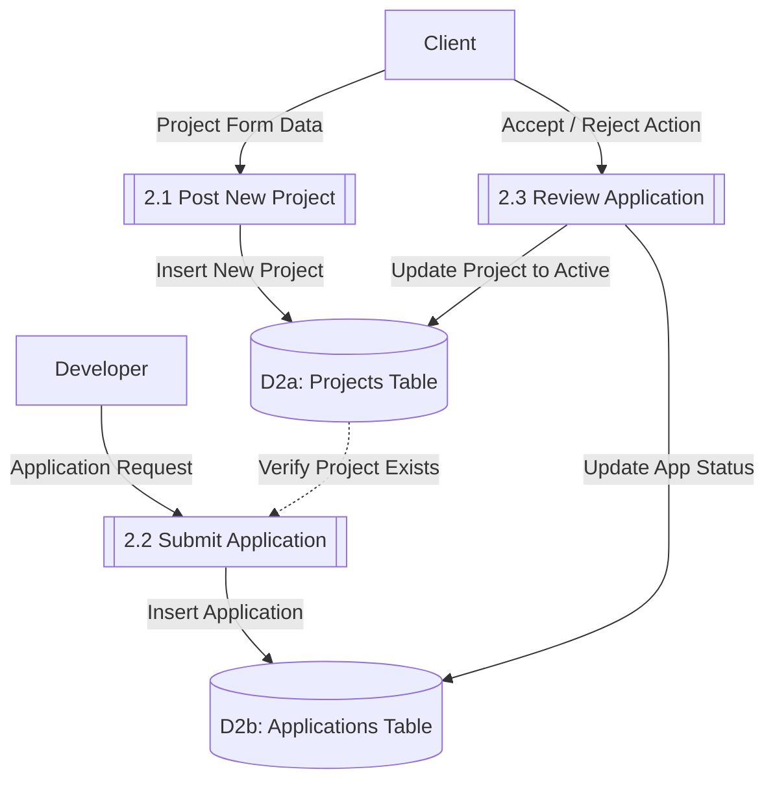
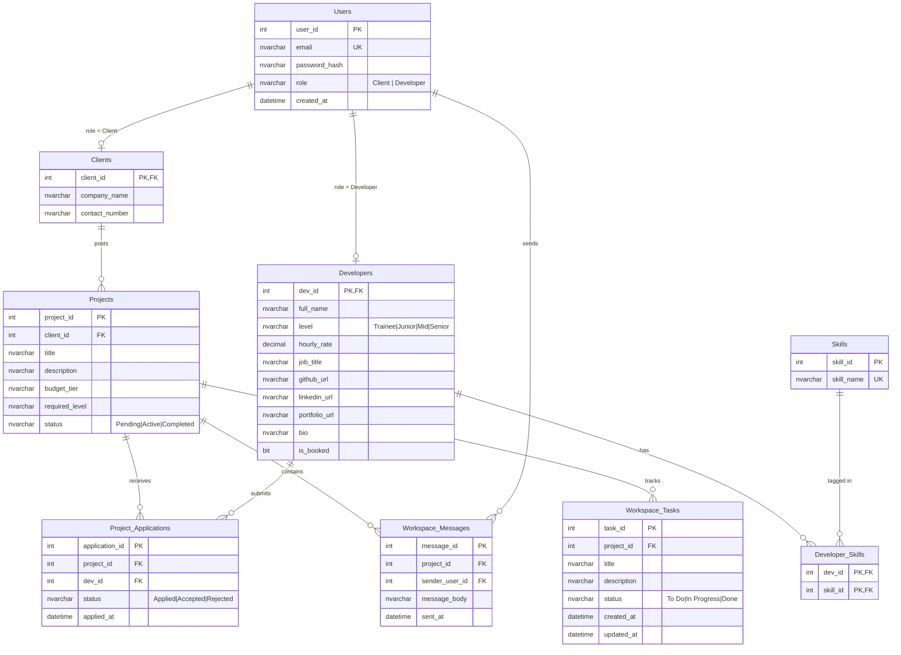

<div align="center">

# ProjectEngine

**A Technical Hiring & Project Collaboration Platform**

[](https://www.microsoft.com/en-us/sql-server)
[](https://www.php.net/)
[](LICENSE)

ProjectEngine bridges the gap between **Clients** who need software built and **Developers** who build it. Post a project, find the right talent by skill and seniority level, and collaborate in a real-time workspace — all from a single platform.

</div>

---

## Official Documentation PDFs

| <a href="https://drive.google.com/file/d/1yGRA91eyGHGpXoG95AVKTy8WsNzXCgAT/view?usp=sharing" target="_blank"></a> | &nbsp;&nbsp;&nbsp;&nbsp;&nbsp;&nbsp;&nbsp;&nbsp; | <a href="https://drive.google.com/file/d/1eXio_cuHRFpBjhJbxi54ySpPzI3S3wEL/view?usp=sharing" target="_blank"></a> |
| :---: | :---: | :---: |
| **[Technical Documentation](https://drive.google.com/file/d/1yGRA91eyGHGpXoG95AVKTy8WsNzXCgAT/view?usp=sharing)** | | **[Data Dictionary](https://drive.google.com/file/d/1eXio_cuHRFpBjhJbxi54ySpPzI3S3wEL/view?usp=sharing)** |

---

## Table of Contents

- [Official Documentation PDFs](#official-documentation-pdfs)
- [Executive Summary](#executive-summary)
- [System Architecture](#system-architecture)
- [Database Schema (ERD)](#database-schema-erd)
- [UI Showcase: Client vs Developer](#ui-showcase-client-vs-developer)
- [Tech Stack](#tech-stack)
- [Installation & Setup](#installation--setup)
- [API Reference](#api-reference)
- [Project Structure](#project-structure)

---

## Executive Summary

### The Problem

Freelancing marketplaces are bloated. They overwhelm clients with thousands of generic profiles and force developers through complex bidding wars. For small-to-mid scale project work — university capstones, startup MVPs, or internal tooling — teams need a **focused, lightweight** platform that cuts straight to collaboration.

### The Solution

ProjectEngine is a purpose-built hiring portal with an integrated workspace. It provides:

| Feature | Description |
|---|---|
| **Role-Based Auth** | Separate registration flows for Clients and Developers with bcrypt-hashed credentials and PHP session management. |
| **Tiered Developer Discovery** | Developers are classified into 4 seniority levels (Trainee → Senior) with skill tags, hourly rates, and portfolio links. Clients filter and hire directly. |
| **Project Lifecycle Management** | Projects flow through `Pending → Active → Completed`. Applications are tracked, accepted, or rejected — with automatic state transitions. |
| **Real-Time Workspace** | Once a developer is hired, both parties enter a shared workspace with a Kanban task board (To Do / In Progress / Done) and a persistent chat channel. |
| **Profile Settings & Account Control** | Users can update their profiles and delete their accounts (with password verification and active-project safety checks). |

### Target Audience

- **Students & Trainees** looking for real-world project experience.
- **Startup Founders** seeking affordable development talent.
- **Mid-Senior Developers** managing their freelance pipeline.

---

## System Architecture

The platform follows a classic **3-tier architecture**: a static HTML/CSS/JS frontend communicates with a PHP API layer, which manages state in a normalized SQL Server database.



### Data Flow Diagrams (DFD)

Data Flow Diagrams illustrate how information routes through the system's processes and databases.

#### 1. Context Diagram
The Context Diagram treats the entire platform as a single process, establishing the system boundary and identifying external entities.



#### 2. DFD Level 0
Level 0 breaks down Process 0.0 into its primary functional subsystems and introduces the main data stores.



#### 3. DFD Level 1 (Decomposition of 2.0 Manage Projects)
Level 1 takes a single Level 0 process (Process 2.0) and decomposes it further to show exactly how data flows at a granular level.



---

## Database Schema (ERD)

The database uses **9 normalized tables** with enforced referential integrity. Users is the central identity table; Clients and Developers are ISA subtypes linked via shared primary keys.



### Key Design Decisions

| Decision | Rationale |
|---|---|
| **ISA Pattern** (Users → Clients/Developers) | Avoids nullable columns. Each role gets its own profile table with role-specific fields. The shared PK guarantees a 1:1 mapping. |
| **ON DELETE CASCADE** from Users | Deleting a user automatically cleans up their Client/Developer profile, skills, and project ownership chain. |
| **ON DELETE NO ACTION** on `Project_Applications.dev_id` | Prevents cascade loops. A developer deletion must be handled explicitly (reject active apps first). |
| **CHECK constraints on enums** | `role`, `level`, `status` — all enforced at the database level so no invalid state can ever reach disk, regardless of API bugs. |
| **Composite PK on Developer_Skills** | Natural key (dev_id + skill_id) prevents duplicates without needing a surrogate ID. |

---

## UI Showcase: Client vs Developer

ProjectEngine renders distinct experiences based on the authenticated user's role. Below is a side-by-side comparison.

### Dashboard

| Client View | Developer View |
|---|---|
|  |  |
| Clients see projects they posted with status badges and an "Enter Workspace" action. | Developers see projects they've applied to or been hired for, with application status tracking. |

### Workspace

| Client View | Developer View |
|---|---|
|  |  |
| Clients can view task progress and communicate via chat. | Developers manage the Kanban board (add/move/delete tasks) and respond in real-time chat. |

### Profile Settings

| Client View | Developer View |
|---|---|
|  |  |
| Clients can update company name and contact details. Email is immutable. | Developers can update their full profile: name, skills, level, hourly rate, bio, and social links. |

### Account Deletion


Both roles can delete their account from the Danger Zone. Password verification is required, and the system blocks deletion if the user has active project connections.

---

## Tech Stack

| Layer | Technology | Notes |
|---|---|---|
| **Frontend** | HTML5, CSS3 (custom properties), Vanilla JS | No frameworks. Single `script.js` handles all routing, API calls, and UI rendering. |
| **Styling** | CSS Grid, Flexbox, CSS Variables | Responsive design with a custom design system (`--primary`, `--accent`, `--bg-card`, etc.). |
| **Backend** | PHP 8.x | RESTful JSON API using `sqlsrv` extension. Session-based auth with `$_SESSION`. |
| **Database** | SQL Server 2019+ (Express) | 9 normalized tables, CHECK constraints, cascading FKs, non-clustered indexes. |
| **Auth** | bcrypt (`password_hash` / `password_verify`) | Industry-standard password hashing. Sessions managed server-side. |
| **Server** | XAMPP (Apache) | Local development stack. PHP connects via `sqlsrv` driver with SQL Server Auth. |

---

## Installation & Setup

### Prerequisites

- **XAMPP** (Apache + PHP 8.x)
- **SQL Server 2019+ Express** with `SQLEXPRESS01` instance
- **PHP SQL Server Drivers** (`php_sqlsrv` and `php_pdo_sqlsrv` DLLs in `ext/`)

### Step 1: Database

Open SQL Server Management Studio and execute:

```sql
-- Run the complete schema file
-- This creates the database, login, tables, constraints, and seed data
database/schema.sql
```

### Step 2: Configure Connection

Edit `api/db_connect.php` if your SQL Server instance name differs:

```php
$serverName   = ".\\SQLEXPRESS01";   // Change to your instance
$databaseName = "ProjectEngineDB";
```

### Step 3: Deploy

Copy the project folder into your XAMPP `htdocs/` directory:

```
C:\xampp\htdocs\ProjectEngine\
```

### Step 4: Launch

Start Apache in XAMPP and navigate to:

```
http://localhost/ProjectEngine/
```

---

## API Reference

All endpoints return `Content-Type: application/json`. Authentication is via PHP sessions (`$_SESSION['user_id']`).

| Method | Endpoint | Auth | Description |
|---|---|---|---|
| `POST` | `/api/register.php` | — | Create a new Client or Developer account |
| `POST` | `/api/login.php` | — | Authenticate and establish session |
| `POST` | `/api/logout.php` | ✓ | Destroy session |
| `GET` | `/api/get_developers.php` | — | List all developers with skills |
| `GET` | `/api/get_profile.php?id=X` | — | Get single developer profile |
| `GET` | `/api/get_projects.php` | ✓ | Get user's projects (role-aware) |
| `POST` | `/api/post_project.php` | Client | Create a new project |
| `POST` | `/api/apply_project.php` | Dev | Apply to a pending project |
| `POST` | `/api/hire_developer.php` | Client | Send hire request to developer |
| `POST` | `/api/review_application.php` | Client | Accept or reject an application |
| `POST` | `/api/respond_hire.php` | Dev | Accept or reject a hire request |
| `GET` | `/api/get_workspace.php?id=X` | ✓ | Load workspace data (project + tasks) |
| `POST` | `/api/add_task.php` | ✓ | Create a Kanban task |
| `POST` | `/api/move_task.php` | ✓ | Change task status |
| `POST` | `/api/delete_task.php` | Dev | Remove a task |
| `GET` | `/api/get_messages.php?id=X` | ✓ | Fetch chat messages for a project |
| `POST` | `/api/send_message.php` | ✓ | Send a chat message |
| `GET` | `/api/get_my_profile.php` | ✓ | Get current user's profile for settings |
| `POST` | `/api/update_profile.php` | ✓ | Update current user's profile |
| `POST` | `/api/delete_account.php` | ✓ | Delete account (password required) |

---

## Project Structure

```
ProjectEngine/
├── index.html              # Landing page (hero + how it works + levels)
├── register.html           # Registration form (Client / Developer toggle)
├── login.html              # Login form
├── dashboard.html          # Role-aware project dashboard
├── developers.html         # Developer discovery with level filtering
├── profile.html            # Dynamic developer profile page
├── workspace.html          # Kanban board + real-time chat
├── post-project.html       # Project creation form (Client only)
├── settings.html           # Profile update + account deletion
├── script.js               # Core application logic (routing, API, UI)
├── style.css               # Design system (variables, components, layouts)
│
├── api/
│   ├── db_connect.php      # SQL Server connection config
│   ├── register.php        # User registration (transaction-based)
│   ├── login.php           # Authentication + session setup
│   ├── logout.php          # Session destruction
│   ├── get_developers.php  # Developer listing with skills
│   ├── get_profile.php     # Single developer profile
│   ├── get_projects.php    # Dashboard project list (role-aware)
│   ├── post_project.php    # Project creation
│   ├── apply_project.php   # Developer application
│   ├── hire_developer.php  # Client hire request
│   ├── review_application.php  # Accept/reject applications
│   ├── respond_hire.php    # Developer response to hire
│   ├── get_workspace.php   # Workspace data loader
│   ├── add_task.php        # Kanban task creation
│   ├── move_task.php       # Task status transition
│   ├── delete_task.php     # Task removal
│   ├── get_messages.php    # Chat message retrieval
│   ├── send_message.php    # Chat message insertion
│   ├── get_my_profile.php  # Current user profile (settings)
│   ├── update_profile.php  # Profile update handler
│   └── delete_account.php  # Account deletion (with safety checks)
│
├── database/
│   └── schema.sql          # Complete DB setup (tables + constraints + seeds)
│
└── imgs/                   # UI screenshots for documentation
```

---

<div align="center">
<sub>Built with purpose. No frameworks, no bloat — just clean architecture.</sub>
</div>
