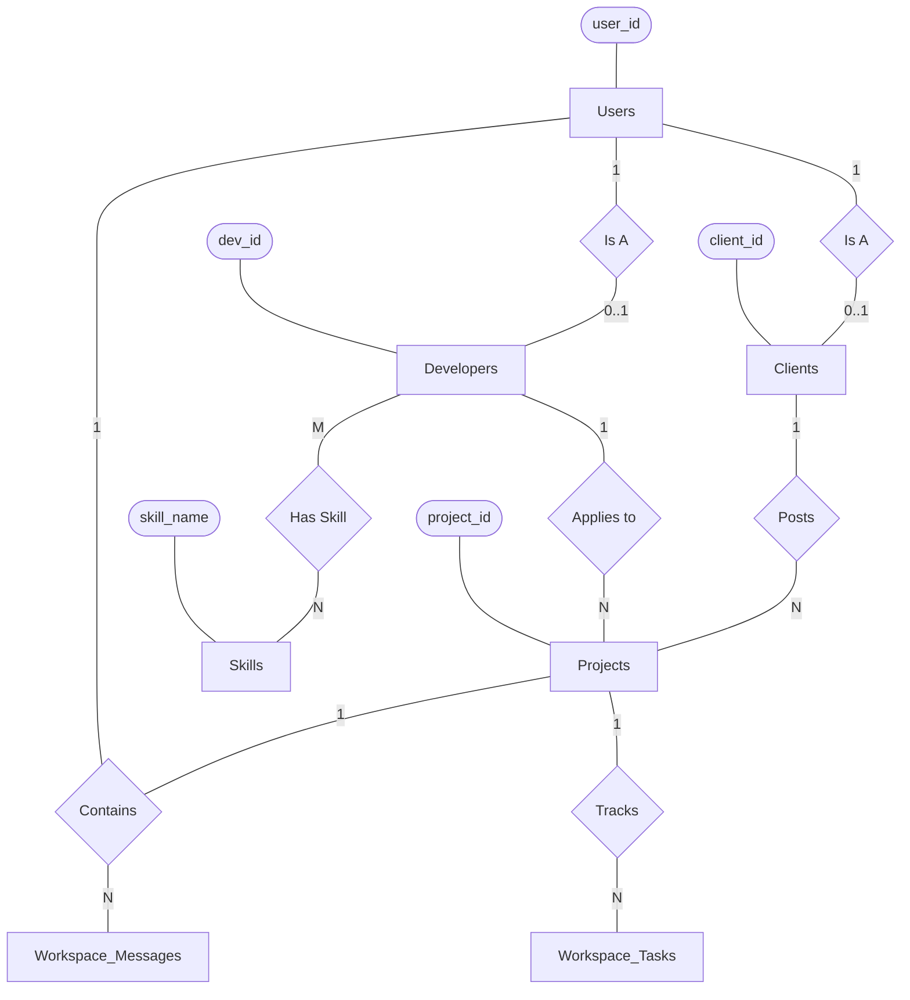
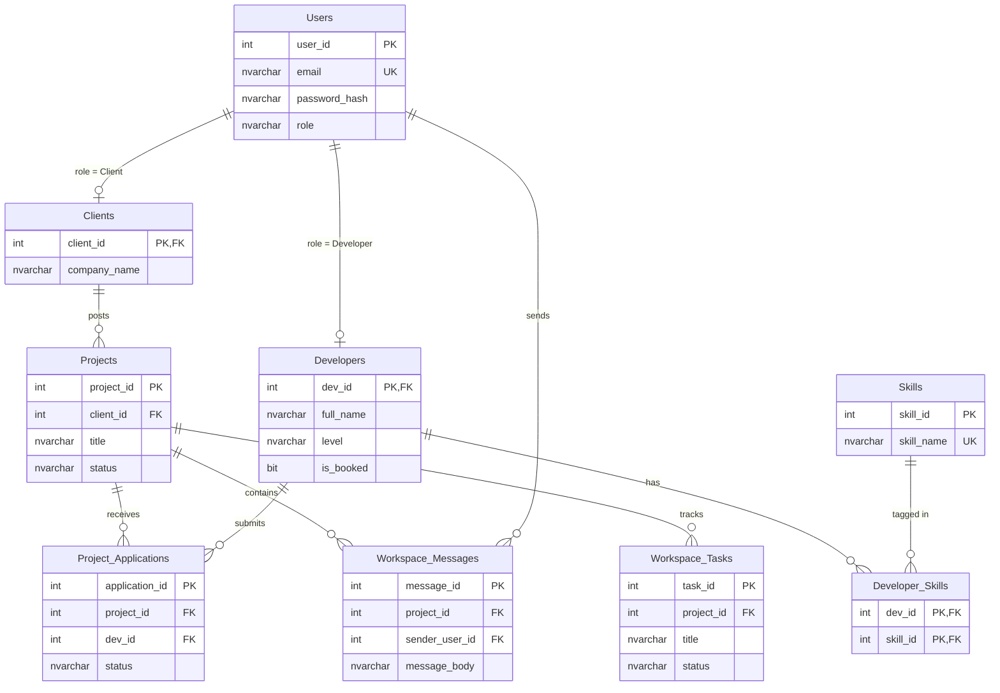
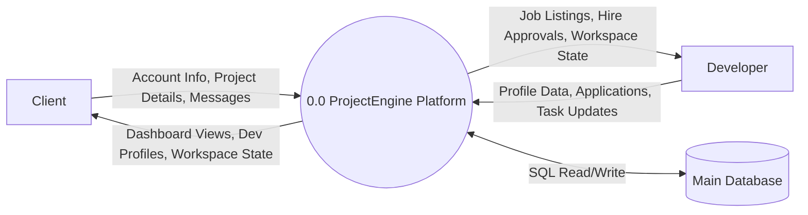
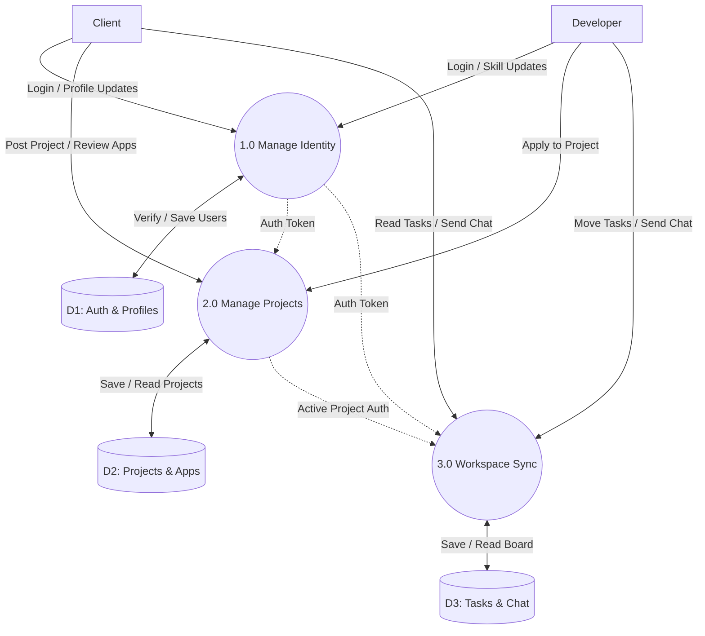

# System Diagrams

This file contains all the academic system models for ProjectEngine. You can use a Markdown previewer (like the built-in VS Code preview or GitHub) to view the rendered diagrams.

---

## 1. Context Diagram
The Context Diagram represents the entire system as a single black-box process, demonstrating how external entities (Clients and Developers) interact with the system at the highest level.

*(Note: In traditional systems analysis, the Context Diagram and DFD Level 0 are often synonymous. This represents the absolute highest-level view).*

---

## 2. ERD (Chen's Notation)
Chen's notation emphasizes Entities (rectangles) and Relationships (diamonds). Attributes (ovals) are simplified here for readability. 

---

## 3. ERD (Database Schema)
This is the physical database schema using standard Crow's Foot notation. It maps exactly to the SQL Server database, showing primary keys (PK), foreign keys (FK), and column data types.

---

## 4. DFD Level 0
The Data Flow Diagram Level 0 breaks the Context Diagram open slightly to show data stores at a very high level, maintaining the single main process.

---

## 5. DFD Level 1
Level 1 Process Decomposition breaks the main system down into its core subsystems (Processes 1.0, 2.0, 3.0) and shows how they route data to specific logical Data Stores.

